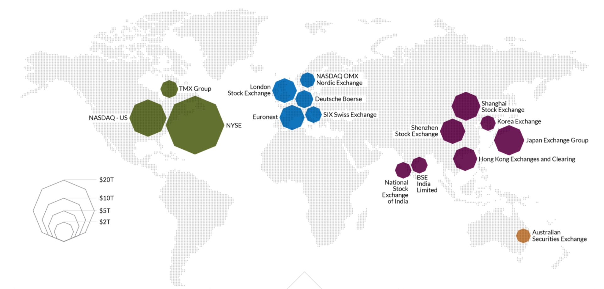
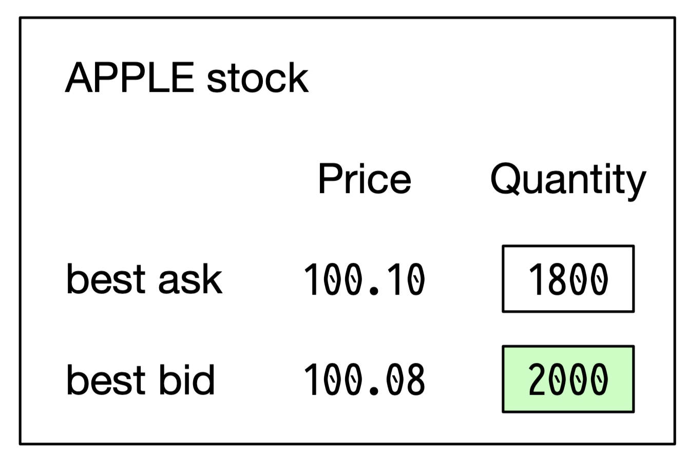
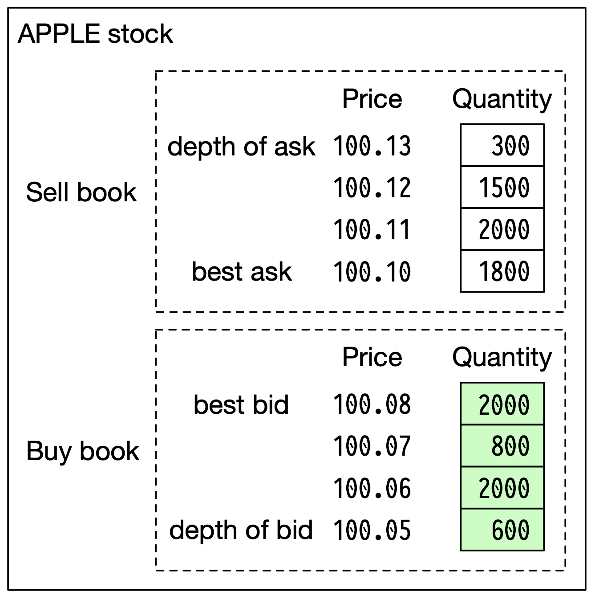
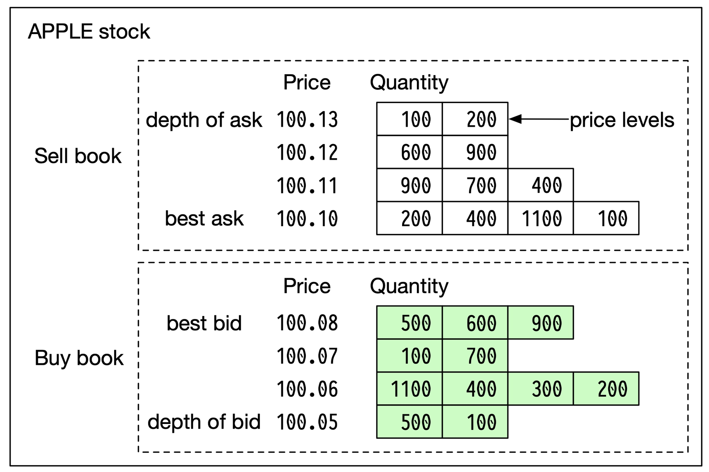
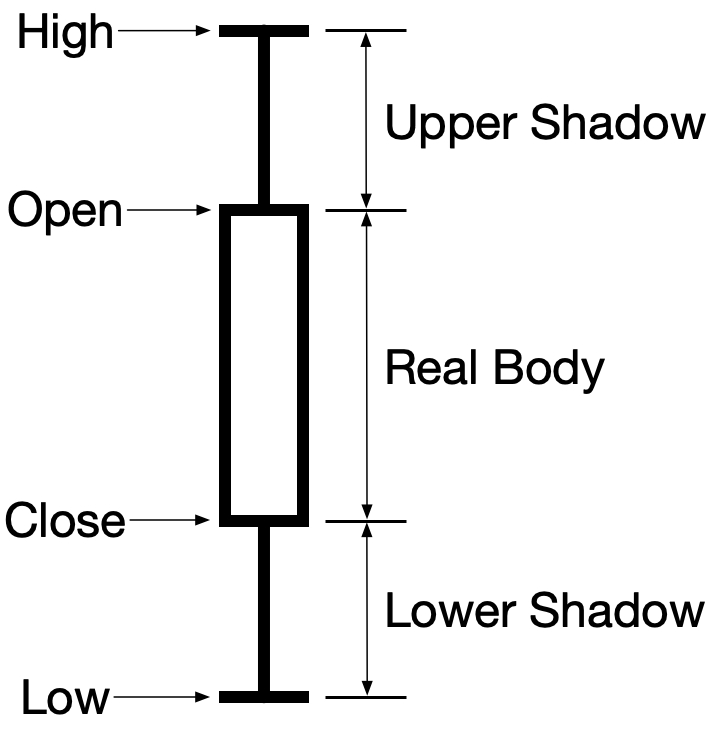
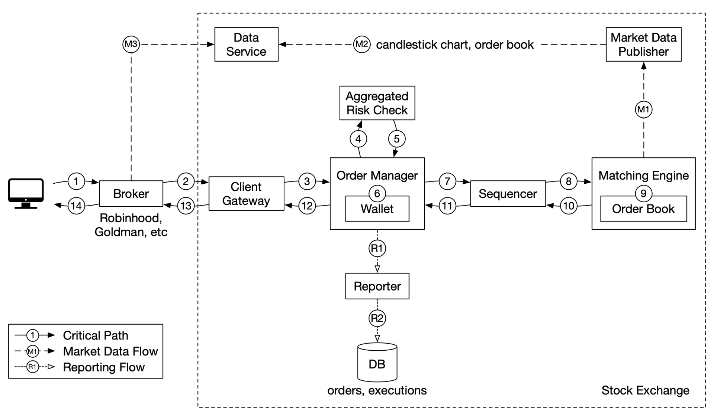
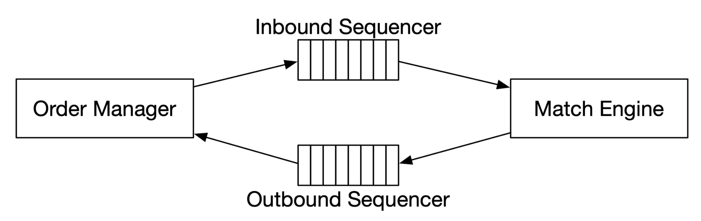
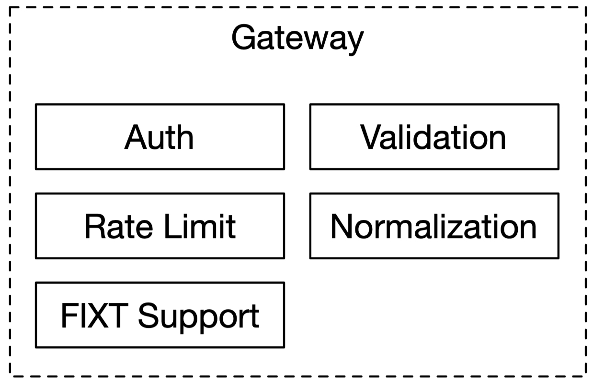
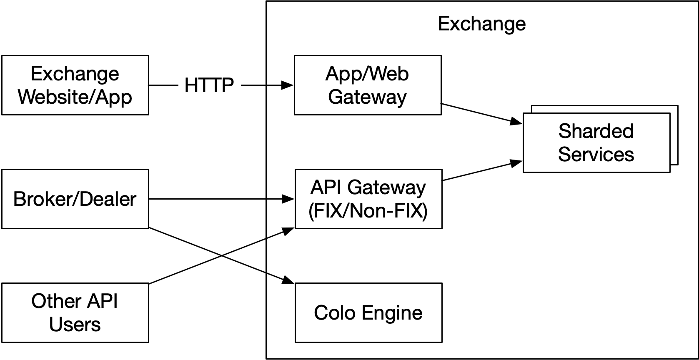
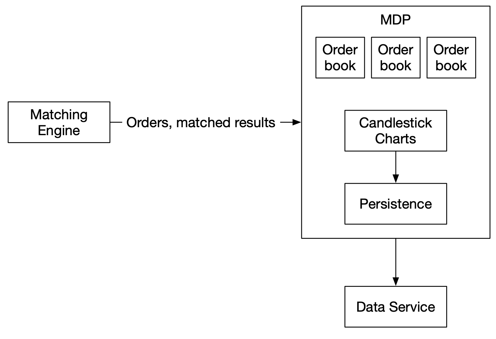

# Chapter 13. Stock Exchange

## Chapter 13. Stock Exchange

---

In this chapter, we design an electronic stock exchange system.

The basic function of an exchange is to facilitate the matching of buyers and sellers efficiently. This fundamental function has not changed over time. Before the rise of computing, people exchanged tangible goods by bartering and shouting at each other to get matched. Today, orders are processed silently by supercomputers, and people trade not only for the exchange of products, but also for speculation and arbitrage. Technology has greatly changed the landscape of trading and exponentially boosted electronic market trading volume.

When it comes to stock exchanges, most people think about major market players like The New York Stock Exchange (NYSE) or Nasdaq, which have existed for over fifty years. In fact, there are many other types of exchange. Some focus on vertical segmentation of the financial industry and place special focus on technology [1], while others have an emphasis on fairness [2]. Before diving into the design, it is important to check with the interviewer about the scale and the important characteristics of the exchange in question.

Just to get a taste of the kind of problem we are dealing with; NYSE is trading billions of matches per day [3], and HKEX about 200 billion shares per day [4]. Figure 1 shows the big exchanges in the “trillion-dollar club” by market capitalization.

<figure>

<figcaption><em>Figure 1 Largest stock exchanges (Source: [5])</em></figcaption>
</figure>

## Step 1 - Understand the Problem and Establish Design scope

A modern exchange is a complicated system with stringent requirements on latency, throughput, and robustness. Before we start, let’s ask the interviewer a few questions to clarify the requirements.

Candidate: Which securities are we going to trade? Stocks, options, or futures?

Interviewer: For simplicity, only stocks.

Candidate: Which types of order operations are supported: placing a new order, canceling an order, or replacing an order? Do we need to support limit order, market order, or conditional order?

Interviewer: We need to support the following: placing a new order and canceling an order. For the order type, we only need to consider the limit order.

Candidate: Does the system need to support after-hours trading?

Interviewer: No, we just need to support the normal trading hours.

Candidate: Could you describe the basic functions of the exchange? And the scale of the exchange, such as how many users, how many symbols, and how many orders?

Interviewer: A client can place new limit orders or cancel them, and receive matched trades in real-time. A client can view the real-time order book (the list of buy and sell orders). The exchange needs to support at least tens of thousands of users trading at the same time, and it needs to support at least 100 symbols. For the trading volume, we should support billions of orders per day. Also, the exchange is a regulated facility, so we need to make sure it runs risk checks.

Candidate: Could you please elaborate on risk checks?

Interviewer: Let’s just do simple risk checks. For example, a user can only trade a maximum of 1 million shares of Apple stock in one day.

Candidate: I noticed you didn’t mention user wallet management. Is it something we also need to consider?

Interviewer: Good catch! We need to make sure users have sufficient funds when they place orders. If an order is waiting in the order book to be filled, the funds required for the order need to be withheld to prevent overspending.

## Non-functional requirements

After checking with the interviewer for the functional requirements, we should determine the non-functional requirements. In fact, requirements like “at least 100 symbols” and “tens of thousands of users” tell us that the interviewer wants us to design a small-to-medium scale exchange. On top of this, we should make sure the design can be extended to support more symbols and users. Many interviewers focus on extensibility as an area for follow-up questions.

Here is a list of non-functional requirements:
- Availability. At least 99.99%. Availability is crucial for exchanges. Downtime, even seconds, can harm reputation.
- Fault tolerance. Fault tolerance and a fast recovery mechanism are needed to limit the impact of a production incident.
- Latency. The round-trip latency should be at the millisecond level, with a particular focus on the 99th percentile latency. The round trip latency is measured from the moment a market order enters the exchange to the point where the market order returns as a filled execution. A persistently high 99th percentile latency causes a terrible user experience for a small number of users.
- Security. The exchange should have an account management system. For legal compliance, the exchange performs a KYC (Know Your Client) check to verify a user’s identity before a new account is opened. For public resources, such as web pages containing market data, we should prevent distributed denial-of-service (DDoS) [6] attacks.

## Back-of-the-envelope estimation

Let’s do some simple back-of-the-envelope calculations to understand the scale of the system:
- 100 symbols
- 1 billion orders per day
- NYSE Stock Exchange is open Monday through Friday from 9:30 am to 4:00 pm Eastern Time. That’s 6.5 hours in total.
- QPS: 1 billion / 6.5 / 3600 = ~43,000
- Peak QPS: 5 x QPS = 215,000. The trading volume is significantly higher when the market first opens in the morning and before it closes in the afternoon.

## Step 2 - Propose High-Level Design and Get Buy-In

Before we dive into the high-level design, let’s briefly discuss some basic concepts and terminology that are helpful for designing an exchange.

## Business Knowledge 101

Broker

Most retail clients trade with an exchange via a broker. Some brokers whom you might be familiar with include Charles Schwab, Robinhood, Etrade, Fidelity, etc. These brokers provide a friendly user interface for retail users to place trades and view market data.

Institutional client

Institutional clients trade in large volumes using specialized trading software. Different institutional clients operate with different requirements. For example, pension funds aim for a stable income. They trade infrequently, but when they do trade, the volume is large. They need features like order splitting to minimize the market impact [7] of their sizable orders. Some hedge funds specialize in market making and earn income via commission rebates. They need low latency trading abilities, so obviously they cannot simply view market data on a web page or a mobile app, as retail clients do.

Limit order

A limit order is a buy or sell order with a fixed price. It might not find a match immediately, or it might just be partially matched.

Market order

A market order doesn’t specify a price. It is executed at the prevailing market price immediately. A market order sacrifices cost in order to guarantee execution. It is useful in certain fast-moving market conditions.

Market data levels

The US stock market has three tiers of price quotes: L1 (level 1), L2, and L3. L1 market data contains the best bid price, ask price, and quantities (Figure 2). Bid price refers to the highest price a buyer is willing to pay for a stock. Ask price refers to the lowest price a seller is willing to sell the stock.

<figure>

<figcaption><em>Figure 2 Level 1 data</em></figcaption>
</figure>

L2 includes more price levels than L1 (Figure 3).

<figure>

<figcaption><em>Figure 3 Level 2 data</em></figcaption>
</figure>

L3 shows price levels and the queued quantity at each price level (Figure 4).

<figure>

<figcaption><em>Figure 4 Level 3 data</em></figcaption>
</figure>

Candlestick chart

A candlestick chart represents the stock price for a certain period of time. A typical candlestick looks like this (Figure 5). A candlestick shows the market’s open, close, high, and low price for a time interval. The common time intervals are one-minute, five-minute, one-hour, one-day, one-week, and one-month.

<figure>

<figcaption><em>Figure 5 A single candlestick chart</em></figcaption>
</figure>

FIX

FIX protocol [8], which stands for Financial Information eXchange protocol, was created in 1991. It is a vendor-neutral communications protocol for exchanging securities transaction information. See below for an example of a securities transaction encoded in FIX.

8=FIX.4.2 | 9=176 | 35=8 | 49=PHLX | 56=PERS | 52=20071123-05:30:00.000 | 11=ATOMNOCCC9990900 | 20=3 | 150=E | 39=E | 55=MSFT | 167=CS | 54=1 | 38=15 | 40=2 | 44=15 | 58=PHLX EQUITY TESTING | 59=0 | 47=C | 32=0 | 31=0 | 151=15 | 14=0 | 6=0 | 10=128 |

## High-level design

Now that we have some basic understanding of the key concepts, let’s take a look at the high-level design, as shown in Figure 6.

<figure>

<figcaption><em>Figure 6 High-level design</em></figcaption>
</figure>

Let’s trace the life of an order through various components in the diagram to see how the pieces fit together.

First, we follow the order through the trading flow. This is the critical path with strict latency requirements. Everything has to happen fast in the flow:

Step 1: A client places an order via the broker’s web or mobile app.

Step 2: The broker sends the order to the exchange.

Step 3: The order enters the exchange through the client gateway. The client gateway performs basic gatekeeping functions such as input validation, rate limiting, authentication, normalization, etc. The client gateway then forwards the order to the order manager.

Step 4 - 5: The order manager performs risk checks based on rules set by the risk manager.

Step 6: After passing risk checks, the order manager verifies there are sufficient funds in the wallet for the order.

Step 7 - 9: The order is sent to the matching engine. When a match is found, the matching engine emits two executions (also called fills), with one each for the buy and sell sides. To guarantee that matching results are deterministic when replay, both orders and executions are sequenced in the sequencer (more on the sequencer later).

Step 10 - 14: The executions are returned to the client.

Next, we follow the market data flow and trace the order executions from the matching engine to the broker via the data service.

Step M1: The matching engine generates a stream of executions (fills) as matches are made. The stream is sent to the market data publisher.

Step M2: The market data publisher constructs the candlestick charts and the order books from the stream of executions as market data.

Step M3: The market data publisher sends the market data to the data service. The published market data is saved to specialized storage for real-time analytics. The brokers connect to the data service to obtain timely market data. Brokers relay market data to their clients.

Lastly, we examine the reporter flow.

Step R1 - R2 (reporting flow): The reporter collects all the necessary reporting fields (e.g. client_id, price, quantity, order_type, filled_quantity, remaining_quantity) from orders and executions, and writes the consolidated records to the database.

Note that the trading flow (steps 1 to 14) is on the critical path, while the market data flow and reporting flow are not. They have different latency requirements.

Now let’s examine each of the three flows in more detail.

## Trading flow

The trading flow is on the critical path of the exchange. Everything must happen fast. The heart of the trading flow is the matching engine. Let’s go over that first.

Matching engine

The matching engine is also called the cross engine. Here are the primary responsibilities of the matching engine:
1. Maintain the order book for each symbol. An order book is a list of buy and sell orders for a symbol. We explain the construction of an order book in the Data models section later.
2. Match buy and sell orders. A match results in two executions (fills), with one each for the buy and sell sides. The matching function must be fast and accurate.
3. Distribute the execution stream as market data.

A highly available matching engine implementation must be able to produce matches in a deterministic order. That is, given a known sequence of orders as an input, the matching engine must produce the same sequence of executions (fills) as an output when the sequence is replayed. This determinism is a foundation of high availability which we will discuss at length in the deep dive section.

Sequencer

The sequencer is the key component that makes the matching engine deterministic. It stamps every incoming order with a sequence ID before it is processed by the matching engine. It also stamps every pair of executions (fills) completed by the matching engine with sequence IDs. In other words, the sequencer has an inbound and an outbound instance, with each maintaining its own sequences. The sequence generated by each sequencer must be sequential numbers, so that any missing numbers can be easily detected. See Figure 7 for details.

<figure>

<figcaption><em>Figure 7 Inbound and outbound sequencers</em></figcaption>
</figure>

The incoming orders and outgoing executions are stamped with sequence IDs for these reasons:
1. Timeliness and fairness
2. Fast recovery / replay
3. Exactly-once guarantee

The sequencer does not only generate sequence IDs. It also functions as a message queue. There is one to send messages (incoming orders) to the matching engine, and another one to send messages (executions) back to the order manager. It is also an event store for the orders and executions. It is similar to having two Kafka event streams connected to the matching engine, one for incoming orders and the other for outgoing executions. In fact, we could have used Kafka if its latency was lower and more predictable. We discuss how the sequencer is implemented in a low-latency exchange environment in the deep dive section.

Order manager

The order manager receives orders on one end and receives executions on the other. It manages the orders’ states. Let’s look at it closely.

The order manager receives inbound orders from the client gateway and performs the following:
- It sends the order for risk checks. Our requirements for risk checking are simple. For example, we verify that a user’s trade volume is below $1M a day.
- It checks the order against the user’s wallet and verifies that there are sufficient funds to cover the trade. The wallet was discussed at length in Chapter 12, “Digital Wallet”. Refer to that chapter for an implementation that would work in the exchange.
- It sends the order to the sequencer where the order is stamped with a sequence ID. The sequenced order is then processed by the matching engine. There are many attributes in a new order, but there is no need to send all the attributes to the matching engine. To reduce the size of the message in data transmission, the order manager only sends the necessary attributes.

On the other end, the order manager receives executions (fills) from the matching engine via the sequencer. The order manager returns the executions for the filled orders to the brokers via the client gateway.

The order manager should be fast, efficient, and accurate. It maintains the current states for the orders. In fact, the challenge of managing the various state transitions is the major source of complexity for the order manager. There can be tens of thousands of cases involved in a real exchange system. Event sourcing [9] is perfect for the design of an order manager. We discuss an event sourcing design in the deep dive section.

Client gateway

The client gateway is the gatekeeper for the exchange. It receives orders placed by clients and routes them to the order manager. The gateway provides the following functions as shown in Figure 8.

<figure>

<figcaption><em>Figure 8 Client gateway components</em></figcaption>
</figure>

The client gateway is on the critical path and is latency-sensitive. It should stay lightweight. It passes orders to the correct destinations as quickly as possible. The functions above, while critical, must be completed as quickly as possible. It is a design trade-off to decide what functionality to put in the client gateway, and what to leave out. As a general guideline, we should leave more complicated functions to the matching engine and risk check.

There are different types of client gateways for retail and institutional clients. The main considerations are latency, transaction volume, and security requirements. For instance, institutions like the market makers provide a large portion of liquidity for the exchange. They require very low latency. Figure 9 shows different client gateway connections to an exchange. An extreme example is the colocation (colo) engine. It is the trading engine software running on some servers rented by the broker in the exchange’s data center. The latency is literally the time it takes for light to travel from the colocated server to the exchange server [10].

<figure>

<figcaption><em>Figure 9 Client gateway</em></figcaption>
</figure>

## Market data flow

The market data publisher (MDP) receives executions (fills) from the matching engine and builds the order books and candlestick charts from the stream of executions. The order books and candlestick charts, which we discuss in the Data Models section later, are collectively called market data. The market data is sent to the data service where they are made available to subscribers. Figure 10 shows an implementation of MDP and how it fits with the other components in the market data flow.

<figure>

<figcaption><em>Figure 10 Market Data Publisher</em></figcaption>
</figure>

## Reporting flow

One essential part of the exchange is reporting. The reporter is not on the trading critical path, but it is a critical part of the system. It provides trading history, tax reporting, compliance reporting, settlements, etc. Efficiency and latency are critical for the trading flow, but the reporter is less sensitive to latency. Accuracy and compliance are key factors for the reporter.

It is common practice to piece attributes together from both incoming orders and outgoing executions. An incoming new order only contains order details, and outgoing execution usually only contains order ID, price, quantity, and execution status. The reporter merges the attributes from both sources for the reports. Figure 11 shows how the components in the report flow fit together.