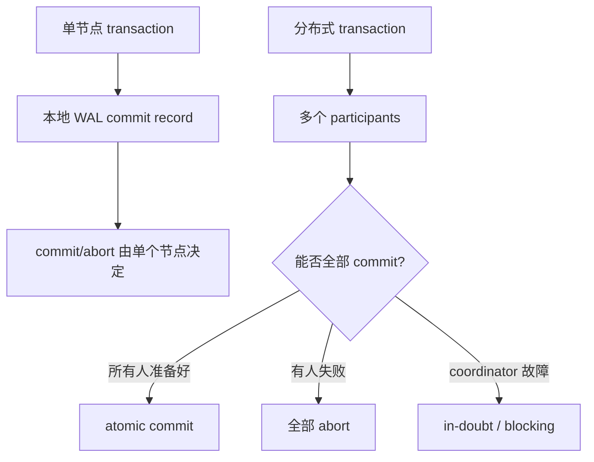
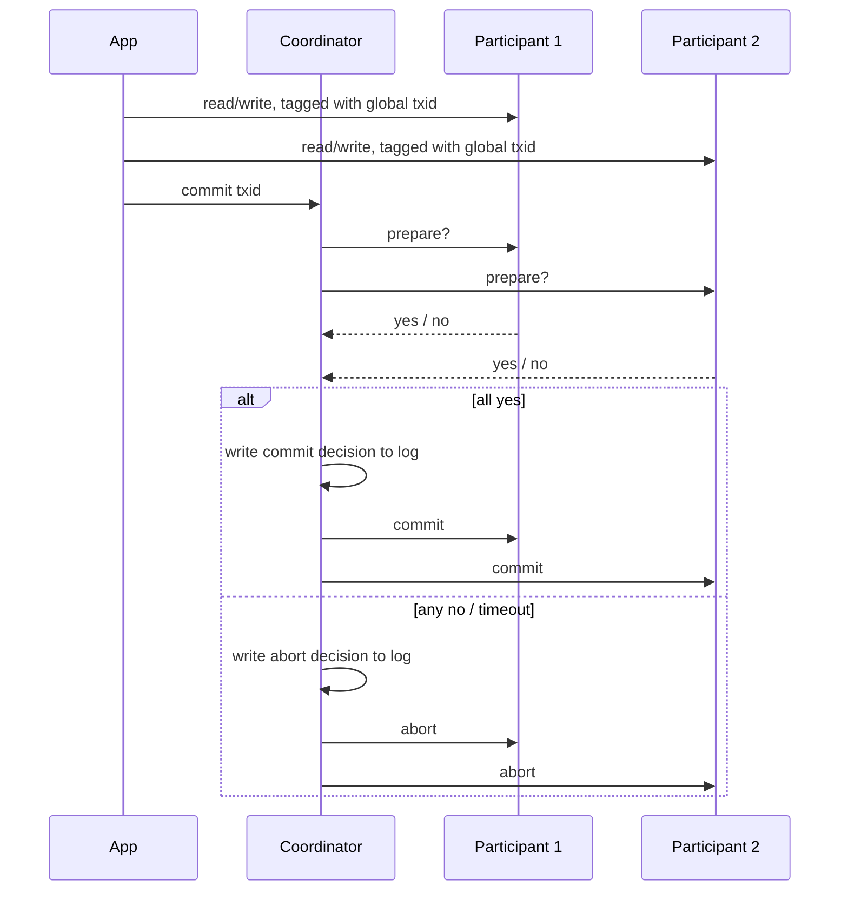
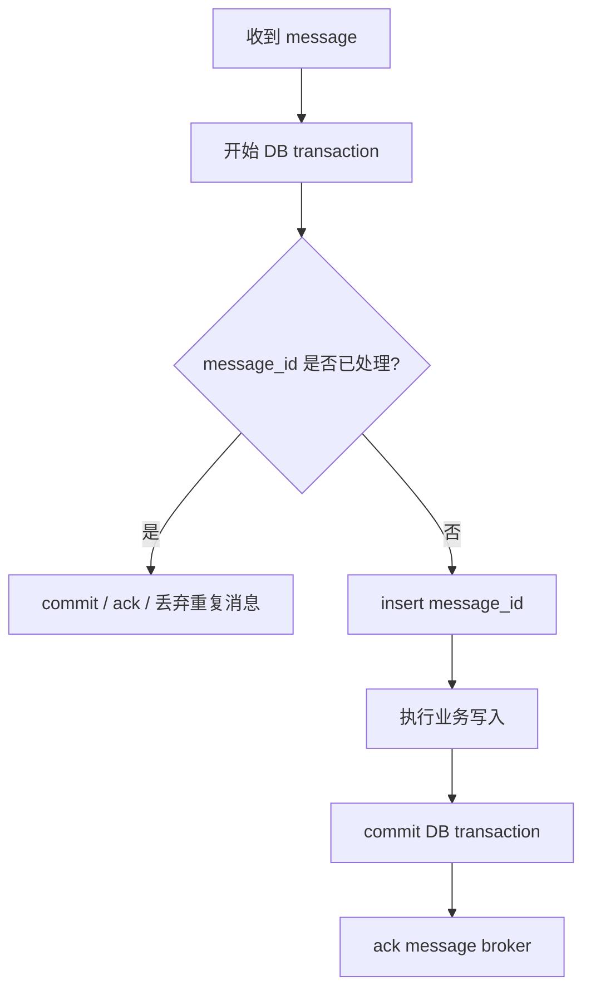

# Distributed Transaction

`distributed transaction` 要解决的核心不是 isolation，而是：**一个 transaction 的 writes 分布在多个节点或多个系统里时，如何保证它们要么全部 commit，要么全部 abort。** 这叫 `atomic commit`。

单节点 transaction 的 commit point 通常是本地 WAL 里 commit record 落盘的时刻；分布式事务的难点在于没有一个天然的“单个磁盘控制器”可以替所有参与者做最终决定。

## 0. 总纲：分布式事务在解决什么

前面讲的 `read committed`、`snapshot isolation`、`serializable` 主要在处理 ACID 里的 `Isolation`：并发 transaction 会不会互相干扰。

分布式事务这一节主要处理 ACID 里的 `Atomicity`：跨多个 participant 的 transaction，能不能避免“有的节点 commit，有的节点 abort”。



这章的递进关系可以记成：

| 问题 | 为什么单节点不明显 | 分布式后发生什么 | 典型机制 / 代价 |
| --- | --- | --- | --- |
| atomic commit | 一个节点自己写 WAL 决定 commit | 多个节点可能部分成功、部分失败 | `2PC` |
| coordinator failure | 单节点没有外部协调者 | participant 可能卡在 in-doubt | 等 coordinator 恢复 |
| lock holding | 本地 transaction 很快结束 | in-doubt 期间 lock 不能释放 | block 其他 transactions |
| heterogeneous systems | 单个数据库内部协议统一 | 数据库、消息队列等接口不同 | `XA`，lowest common denominator |
| exactly-once processing | 单系统 retry 相对好处理 | message ack 与 database write 可能分裂 | distributed transaction 或 idempotence |

> [!CAUTION] Wenbo 注
> `distributed transaction` 不自动等于 `serializable`。它主要解决跨 participant 的 commit atomicity。Isolation 仍然要看底层数据库提供的是 snapshot isolation、serializable，还是更弱的级别。

## 1. 为什么不能直接给所有节点发 commit

假设一个 transaction 修改两个 shard：数据库 1 和数据库 2。应用写完后直接向两个节点发送 commit 请求。

可能出现这些情况：

```text
DB1: commit 成功
DB2: 因为 constraint violation abort

或：

DB1: 收到 commit 并落盘
DB2: commit request 在网络里丢了，超时后 abort

或：

DB1: commit record 已写入 WAL
DB2: 写 commit record 前 crash，恢复后 rollback
```

结果是同一个 logical transaction 在某些节点 commit，在某些节点 abort。这个状态通常无法安全修复，因为已 commit 的数据可能已经被其他 transaction 读到。你不能事后说“刚才 DB1 上那次 commit 不算了”，否则已经基于它做决策的后续 transaction 也要被追溯撤销。

所以分布式事务要解决的是 `atomic commit`：所有 participant 对同一个 transaction 的结论必须一致。

## 2. 2PC：two-phase commit 的基本流程

`two-phase commit`（2PC）是经典 atomic commit 协议。它引入一个新角色：`coordinator`，也叫 transaction manager。真正保存数据的节点叫 `participant`。

2PC 分两阶段：



Phase 1 是 `prepare`：coordinator 问每个 participant：“如果我稍后要求你 commit，你能保证 commit 吗？”

Phase 2 是 `commit/abort`：如果所有人都说 yes，coordinator 决定 commit；只要有人说 no 或 timeout，coordinator 决定 abort。

这里的 `global txid` 是 coordinator 分配的全局 transaction id。应用在 P1、P2 上做的读写，本质上仍然是各自 participant 上的本地 transaction；但它们都带着同一个 global txid，所以 coordinator 和 participants 知道这些本地 transaction 属于同一个 distributed transaction，后面要一起 prepare、一起 commit 或一起 abort。

## 3. 2PC 的关键不是两轮消息，而是承诺系统

2PC 能保证 atomicity，不是因为 prepare/commit 消息不会丢。消息仍然会丢，节点仍然会 crash。关键在于两个不可撤销的承诺。

| 时刻 | 谁做承诺 | 承诺内容 | 为什么重要 |
| --- | --- | --- | --- |
| participant 投 yes | participant | 我已经把必要状态写到 durable storage，之后如果被要求 commit，我一定能 commit | participant 放弃单方面 abort 的权利 |
| coordinator 写 decision log | coordinator | 最终决定已经落盘，commit 或 abort 不可反悔 | 这是整个分布式 transaction 的 commit point |

participant 在投 yes 前必须确认：

- 事务数据已经 durable；
- constraint 和冲突检查已经通过；
- 即使之后 crash/recover，也能根据 txid 找回 prepared transaction；
- 如果 coordinator 后来要求 commit，不能再用磁盘满、constraint 失败等理由拒绝。

coordinator 收齐投票后，只有在所有 participant 都 yes 时才能决定 commit。这个决定必须先写入 coordinator 的本地 transaction log，然后再通知 participants。之后如果 commit message 丢了，coordinator 必须一直重试，直到 participant 收到并执行。

一句话：**2PC 把“大家能不能 commit”拆成先承诺、再宣布；atomicity 来自这些 durable promises。**

## 4. 2PC 和 2PL 不要混

这两个名字很像，但解决的问题完全不同：

| 缩写 | 全称 | 解决什么 | 属于 ACID 哪部分 |
| --- | --- | --- | --- |
| `2PL` | two-phase locking | 并发 transaction 如何做到 serializable isolation | `Isolation` |
| `2PC` | two-phase commit | 多个 participant 如何 all-or-nothing commit | `Atomicity` |

`2PL` 是 locking / concurrency control；`2PC` 是 distributed commit protocol。它们可以同时出现，但不是一回事。

## 5. Coordinator Failure：为什么 2PC 会 blocking

2PC 最大的问题是：participant 投 yes 后，不能再自己决定 commit 或 abort。它必须等 coordinator 的最终决定。

如果 coordinator 在关键时刻 crash，就会出现 `in-doubt transaction`：participant 知道自己已经 prepared，但不知道最终结果。

```text
P1: prepare -> yes
P2: prepare -> yes
Coordinator: 决定 commit，并写入自己的 log
Coordinator: 向 P2 发送 commit，P2 commit 成功
Coordinator: 还没通知 P1 就 crash

P1: 我该 commit 还是 abort？不知道。
```

P1 不能单方面 abort，因为 P2 可能已经 commit；P1 也不能单方面 commit，因为 coordinator 可能实际决定 abort，或其他 participant 可能 abort。timeout 也没用：在这种状态下，超时不能提供新事实。

所以 2PC 是 `blocking atomic commit protocol`：在 coordinator 恢复前，in-doubt participant 只能等。

coordinator 必须把决定写到 durable log，原因就在这里：恢复后，它要读自己的 log，告诉所有 in-doubt participants 最终应该 commit 还是 abort。如果 coordinator log 里没有 commit decision，事务通常会被 abort；如果有 commit decision，就必须继续 commit。

## 6. In-Doubt 为什么危险：锁会一直持有

in-doubt 不只是“后台有个事务悬着”。它会影响系统可用性，因为 prepared transaction 通常不能释放它已经持有的 locks。

原因是：如果 participant 投 yes 后释放 lock，别的 transaction 可能读/写这些数据；但最终 coordinator 也许会要求 commit，这会破坏 isolation 或 atomicity。

| 状态 | lock 是否能释放 | 后果 |
| --- | --- | --- |
| transaction 正常 commit/abort | 可以释放 | 其他 transaction 继续 |
| transaction prepared / in-doubt | 不能释放 | 访问相同 rows/ranges 的 transaction 被 block |
| coordinator log 丢失或损坏 | 可能长期不能释放 | 需要人工介入，严重时造成 outage |

如果 coordinator 20 分钟后才恢复，locks 可能持有 20 分钟。如果 coordinator 的 log 丢了，数据库甚至重启也不能随便清掉这些 locks，因为那可能违反 atomic commit promise。

这就是为什么 2PC 的 operational risk 很大：它把 coordinator 的 durable log 变成整个系统 correctness 的关键状态。

## 7. Three-Phase Commit 为什么不是通用答案

`three-phase commit`（3PC）试图让 atomic commit 在 coordinator failure 时不 blocking。但它依赖很强的假设：网络延迟有上界，节点响应时间有上界。

现实分布式系统通常不能依赖这些假设：

- network delay 可能无限长；
- process pause 可能很久，例如 GC、调度、虚拟化暂停；
- 你很难区分“节点死了”和“节点只是暂时慢”。

所以在真实系统里，3PC 不能普遍保证 atomicity。更实际的方向是用 consensus 来复制 coordinator，让 coordinator failure 可以自动 failover。这会在后面 consensus 章节展开。

## 8. 两类分布式事务：内部 vs 异构

“分布式事务”这个词经常混用，至少要区分两类：

| 类型 | participants | 例子 | 特点 |
| --- | --- | --- | --- |
| 数据库内部的分布式事务 | 同一个数据库系统的多个 shard / replica | Spanner、CockroachDB、TiDB、FoundationDB、YugabyteDB | 协议可以深度定制，通常更可靠、更快 |
| 异构分布式事务 | 不同技术、不同 vendor 的系统 | 一个数据库 + 一个 message broker；两个不同数据库 | 只能走通用接口，容易落入 lowest common denominator |

数据库内部事务通常更可控：所有 participant 运行同一套软件，系统可以把 atomic commit、replication、concurrency control、deadlock detection、consistent read 放在一起设计。

异构事务难得多：数据库、消息队列、外部服务的能力不同，接口不同，错误模型不同。为了兼容所有系统，协议只能使用大家都支持的最小公共能力。

## 9. XA：跨异构系统的 2PC 标准

`XA`（X/Open XA）是跨异构系统实现 2PC 的标准接口。它常见于传统关系数据库、消息代理、Java EE / JTA 生态。

要点：XA 不是网络协议，而是 participant driver 和 transaction coordinator 之间的一套 API。

典型结构：

```text
application process
  -> transaction coordinator library / JTA transaction manager
  -> JDBC driver / JMS driver
  -> database / message broker participants
```

coordinator 通常作为应用进程里的库存在。它负责：

- 生成并跟踪全局 transaction id；
- 记录 participants；
- 发起 prepare；
- 收集 yes/no；
- 把 commit/abort decision 写入本地 log；
- 通过 driver 回调要求 participants commit/abort。

这带来一个很尖锐的问题：**coordinator 的 log 通常在应用服务器本地磁盘上，但它却变成分布式事务 correctness 的关键 durable state。**

如果应用进程或机器 crash，coordinator 也消失。prepared participants 进入 in-doubt，必须等应用服务器和 coordinator log 恢复后才能知道最终结果。

## 10. XA 的主要问题

XA 的问题不是“理论上错”，而是工程边界很硬。

| 问题 | 具体表现 | 后果 |
| --- | --- | --- |
| coordinator 单点 | coordinator 常在应用进程里，log 在本地磁盘 | 应用服务器故障会让 participants in-doubt |
| 通信路径绕应用 | coordinator 和 participant 不能直接用统一协议互相通信 | 恢复依赖应用代码、driver、coordinator log |
| in-doubt locks | prepared transaction 不能释放 locks | block 其他 transactions，可能造成 outage |
| orphaned transaction | coordinator log 丢失或损坏，无法判断结果 | 需要管理员手动 commit/rollback |
| heuristic decision | participant 紧急情况下单方面决定 | 可能破坏 atomicity，只能灾难恢复时用 |
| lowest common denominator | 要兼容不同系统能力 | 难以做跨系统 deadlock detection、SSI conflict detection |

尤其要注意 `heuristic decision`：这个名字听起来像优化，实际上是“为了摆脱灾难状态，允许破坏 2PC 的承诺系统”。它只能作为最后的逃生门，不能当正常机制。

## 11. Exactly-Once：分布式事务不是唯一解

异构分布式事务的一个经典 use case 是 message processing：只有当数据库写入成功 commit 时，才 ack message broker。

理想模型：

```text
process message
-> write database
-> ack message
```

如果 database write 成功但 ack 失败，message broker 会 redeliver，可能重复处理。如果 ack 成功但 database write 失败，message 就丢了。用 2PC 把 database write 和 message ack 放进同一个 atomic commit，可以解决这个分裂。

但原书强调：对很多 exactly-once processing 场景，不一定需要跨 database 和 broker 的 distributed transaction。可以用数据库内 transaction + idempotence：



关键是给每条 message 一个唯一 ID，并在数据库里维护 processed message id 表：

1. 开始处理 message 时，在同一个数据库 transaction 中检查 `message_id`；
2. 如果已经存在，说明处理过，可以 ack 并丢弃；
3. 如果不存在，插入 `message_id`，执行业务写入，然后 commit；
4. 如果 commit 后 ack 前 crash，broker 会重发，但重试会发现 `message_id` 已存在，不会重复 side effect；
5. 如果两个 worker 并发处理同一 message，`message_id` 的 unique constraint 会挡住重复插入。

这个模式的本质是把 message processing 做成 `idempotent`：重试多次，效果仍然等价于一次。

> [!CAUTION] Wenbo 注
> “Exactly once” 很多时候不是物理上真的只执行一次，而是通过 transaction、dedup key、idempotence，让外部可观察效果等价于一次。

## 12. 数据库内部事务为什么更可行

数据库内部的分布式事务通常比 XA 更健康，因为它们不需要兼容异构系统，可以整体设计：

- coordinator 可以 replicated，primary 崩溃后自动 failover；
- coordinator 和 data shard 可以直接通信，不必绕 application code；
- participant shard 自己也可以 replicate，减少单 shard failure 导致 abort 的概率；
- atomic commit 可以和 distributed concurrency control 结合，例如 cross-shard deadlock detection、consistent read、distributed SSI；
- consensus 可以复制 coordinator 和 shard 的关键状态，减少人工恢复。

所以不要把“XA 很难用”直接推广成“所有分布式事务都不该用”。内部事务和异构事务的工程条件完全不同。

## 13. 工程判断：什么时候需要，什么时候绕开

适合考虑分布式事务的场景：

- 一个业务 invariant 必须跨多个 shard 原子维护；
- global secondary index 和 primary data 分布在不同节点，需要同步更新；
- 系统本身是支持内部事务的 distributed database；
- correctness 明显比写入延迟和吞吐更重要；
- 没有自然的 idempotent / compensating workflow 可以替代。

应该谨慎或避免 XA 的场景：

- participants 是不同 vendor / 不同技术栈；
- coordinator 只是应用进程里的本地库；
- 不能接受 in-doubt locks 造成长时间 block；
- 运维团队无法快速识别和处理 orphaned transaction；
- 外部 side effect 不支持 rollback，例如发送 email、调用第三方支付 API。

可替代方案通常包括：

| 方案 | 思路 | 适合场景 |
| --- | --- | --- |
| idempotence / dedup key | 让 retry 安全，重复执行不重复生效 | message processing、API request retry |
| outbox pattern | 在 DB transaction 中写业务数据和 outbox event，再异步发送 | 数据库 + message broker 集成 |
| saga / compensating action | 每步本地 commit，失败后执行补偿 | 长流程、跨服务业务流程 |
| derived data / async repair | 接受短暂不一致，通过日志和重算修复 | 搜索索引、缓存、分析视图 |
| 内部分布式数据库 transaction | 交给统一数据库系统处理 | 跨 shard OLTP invariant |

## 14. 一句话总结

分布式事务的核心问题是 `atomic commit`：多个 participant 必须对同一个 transaction 得出一致结论。`2PC` 通过 prepare promise 和 coordinator decision log 实现 all-or-nothing，但代价是 blocking、in-doubt locks 和 coordinator recovery 复杂度。`XA` 把 2PC 扩展到异构系统，却容易落入 lowest common denominator 和运维困境。真实工程里，要区分数据库内部事务和异构事务；能用 idempotence、outbox、saga 或内部事务解决的地方，不要轻易把 XA 当成默认答案。
