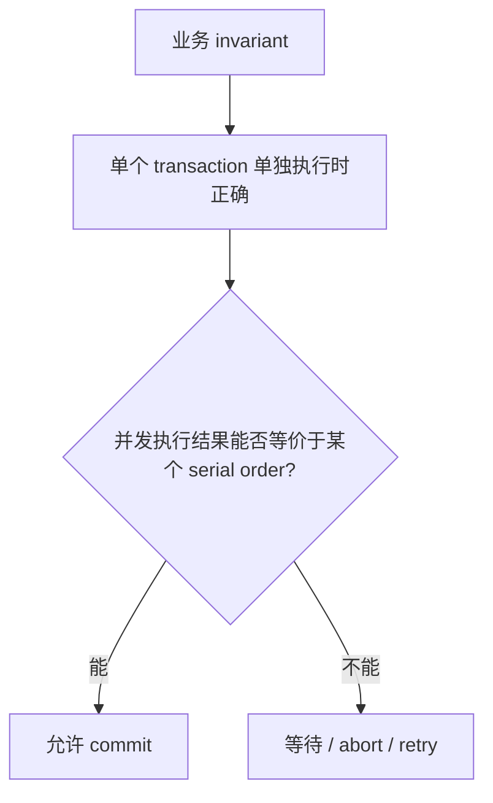
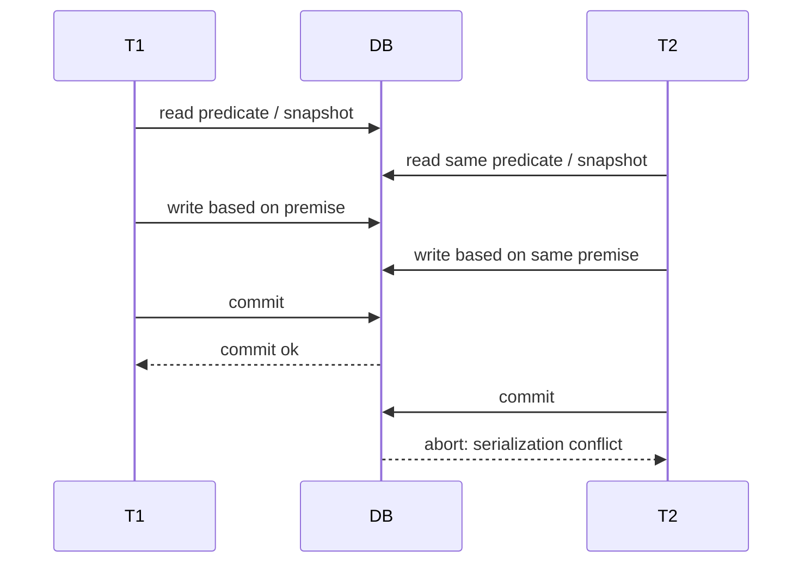

# Serializable Isolation

`serializable isolation` 是 transaction isolation 里最强、也最容易被误解的一层。它的核心不是“真的没有并发”，而是：**并发执行的最终结果必须等价于某个 serial order，也就是好像这些 transactions 是一个接一个执行的。**

它主要解决前面弱隔离级别留下的问题：`lost update`、`write skew`、`phantom read`，尤其是那些“每个 transaction 单独看都合法，但并发组合后破坏 invariant”的情况。

## 0. 总纲：Serializable 解决什么

弱隔离级别的问题可以这样理解：

```text
read committed
-> 不读/不写未提交数据
-> 但同一个 transaction 可能看到不一致时间点

snapshot isolation
-> reads 来自一致快照
-> 但多个 transaction 可能基于同一个旧前提分别写入

serializable isolation
-> commit 后的结果必须能解释成某个串行顺序
-> 如果解释不了，就必须 block、等待、或 abort/retry
```

如果一个业务 invariant 在每个 transaction 单独运行时都能被正确维护，那么 serializable 的承诺是：**这些 transactions 并发运行后，invariant 仍然应该成立**。



> [!CAUTION] Wenbo 注
> `serializable` 只是在讲 ACID 里的 `Isolation`。它不自动等于完整 ACID：transaction 是否能 rollback 是 `Atomicity`，commit 后是否 survive crash 是 `Durability`，业务 invariant 是否被正确表达还要靠应用和 constraint。

## 1. 为什么 weak isolation 不够

`snapshot isolation` 最有迷惑性的地方是：它给每个 transaction 一个一致快照，所以读起来像是“世界很稳定”。但稳定不等于最新，也不等于可串行化。

医生值班例子：

```text
invariant: 至少 1 个医生 on_call
初始: Aaliyah = on_call, Bryce = on_call

T1: read on_call doctors -> 2
T2: read on_call doctors -> 2
T1: set Aaliyah = off_call
T2: set Bryce = off_call

最终: 0 个医生 on_call
```

在 snapshot isolation 下，T1 和 T2 都基于自己的 snapshot 做出了看似合理的决定。但最终结果无法等价于任何串行顺序：

```text
如果 T1 先执行完，T2 后执行，T2 应看到只剩 1 个医生，不能下班。
如果 T2 先执行完，T1 后执行，T1 应看到只剩 1 个医生，不能下班。
```

所以 serializable 的目标不是防某一个具体 anomaly，而是防所有“无法解释为串行执行”的 interleaving。

## 2. 三类实现思路

原书把实现 serializable 的主流技术分成三类。它们解决的是同一个正确性目标，但手段完全不同：

| 实现方式 | 核心想法 | 并发策略 | 主要代价 | 适合场景 |
| --- | --- | --- | --- | --- |
| Actual serial execution | 直接一次执行一个 transaction | 消除并发 | 受单线程 / 单分区吞吐限制 | transaction 很短、数据可内存化、stored procedure 可接受 |
| Two-phase locking (`2PL`) | 先拿锁，冲突就等待 | pessimistic | reader/writer 互相 block，latency 抖动，deadlock | 强一致 OLTP，能接受 lock 等待 |
| Serializable snapshot isolation (`SSI`) | 先并发跑，commit 时检测危险依赖 | optimistic | 有 tracking overhead，冲突时 abort/retry | read-heavy、低/中等冲突、希望 reader/writer 少阻塞 |

一句话记忆：

```text
serial execution: 不让并发发生
2PL: 并发前先阻止危险动作
SSI: 先让并发发生，提交前检查是否危险
```

## 3. Actual Serial Execution：用单线程换简单正确性

最直接的 serializable 实现是：**一个 partition 上一次只执行一个 transaction**。既然没有并发 interleaving，就天然 serializable。

这听起来像倒退，但在一些条件下是可行的：

- RAM 变大后，很多 OLTP working set 可以放进内存，减少等待磁盘 I/O；
- transaction 很短时，单线程可以跑很高吞吐；
- stored procedure 可以把多步业务逻辑一次提交给数据库，避免 client 和 database 多轮网络交互。

限制也很明显：

- 不适合 interactive multi-statement transaction，比如用户打开页面编辑几分钟再提交；
- 单个 partition 的写吞吐受单核限制；
- 如果 transaction 需要访问多个 shard，就要跨 shard 协调 serial order，复杂度和延迟都会上升。

所以 serial execution 的关键不是“单线程一定慢”，而是：**只有当 transaction 很短、逻辑可预先提交、数据访问局部性好时，它才漂亮。**

## 4. Two-Phase Locking：悲观地先挡住冲突

`two-phase locking`（2PL）是老牌 serializable 实现。它和 `two-phase commit`（2PC）没有关系：

| 概念 | 解决什么 | 属于哪类问题 |
| --- | --- | --- |
| `2PL` / two-phase locking | serializable isolation | concurrency control |
| `2PC` / two-phase commit | distributed atomic commit | distributed transaction commit protocol |

2PL 的思路是 pessimistic concurrency control：如果某个操作可能和别人冲突，就先等待，直到安全再继续。

基本锁规则：

- 多个 transactions 可以同时读同一个 object，因为 shared locks 兼容；
- 一旦有人要写，就需要 exclusive lock；
- writer 会 block reader，reader 也会 block writer；
- locks 通常持有到 transaction 结束，保证其他 transaction 不能在中途观察或制造不可串行化状态。

这里的 `block` 是“等待锁释放”的意思，不是报错，也不是读旧版本继续执行。比如：

```text
writer block reader:
T1: write row A，拿到 exclusive lock，但还没 commit
T2: read row A
T2: 不能像 MVCC 那样读旧版本，必须等 T1 commit/abort 后才能读

reader block writer:
T1: read row A，拿到 shared lock，但还没 commit
T2: write row A，需要 exclusive lock
T2: 必须等 T1 commit/abort 释放 shared lock 后才能写
```

这样做的目的是防止 transaction 基于一个之后会被改掉的前提继续执行，也防止别人读到一个会破坏 serial order 的中间状态。代价是读写之间会互相排队。

`deadlock` 是更麻烦的等待：两个 transaction 互相等对方释放 lock，谁也走不下去。

```text
T1: lock row A
T2: lock row B
T1: 想 lock row B，但 B 被 T2 锁着，于是等待
T2: 想 lock row A，但 A 被 T1 锁着，于是等待

结果: T1 等 T2，T2 等 T1
```

数据库通常会检测这种 wait cycle，然后 abort 其中一个 transaction，让另一个继续。被 abort 的 transaction 需要由应用 retry，所以 deadlock 不只是“慢一点”，还会造成重复工作。

这和 snapshot isolation 的差别很大：

| 机制 | reader 会 block writer？ | writer 会 block reader？ | 直觉 |
| --- | --- | --- | --- |
| Snapshot isolation / MVCC | 通常不会 | 通常不会 | 读旧版本，写新版本 |
| 2PL | 会 | 会 | 用锁保护 serial order |

2PL 的好处是强：它能防 `lost update`、`write skew`、`phantom read`。坏处也直接：latency 可能很不稳定。

`latency 抖动` 的意思是：同一类 query 有时很快，有时突然很慢，而且慢的不一定是它自己做了很多工作，而是它在等别人的 lock。一个慢 transaction 或大范围查询如果拿了很多 lock，后面的 readers/writers 都可能被卡住；等锁链条继续传递，就会让 tail latency 变高。比如平时 5 ms 的读请求，碰到一个还没 commit 的写 transaction，可能变成 500 ms，甚至超时。

## 5. Lock 术语地图：这些 lock 到底分别是什么

这一节里出现了很多 lock 名字，容易混在一起。可以先分成三层看：

1. **锁的模式**：shared lock、exclusive lock，描述“读锁/写锁是否兼容”。
2. **锁的对象范围**：row lock、table lock、predicate lock、index-range lock，描述“锁住什么东西”。
3. **并发控制策略**：pessimistic、optimistic，描述“先阻塞冲突，还是先执行再检测”。

### 5.1 Shared Lock 与 Exclusive Lock

`shared lock` 可以理解成读锁。多个 transactions 可以同时持有同一个 object 的 shared lock，因为大家都只读，不会互相改变对方看到的数据。

`exclusive lock` 可以理解成写锁。只要某个 transaction 想修改 object，就需要 exclusive lock；exclusive lock 和其他 shared/exclusive locks 都不兼容。

| 已持有的锁 | 新请求 shared lock | 新请求 exclusive lock |
| --- | --- | --- |
| 无锁 | 可以 | 可以 |
| shared lock | 可以，多个 readers 共存 | 不可以，writer 要等 readers 结束 |
| exclusive lock | 不可以，reader 要等 writer 结束 | 不可以，writer 要等 writer 结束 |

所以 2PL 里的 reader/writer 互相 block，本质上就是 shared lock 和 exclusive lock 的兼容性规则导致的。

### 5.2 Row Lock、Table Lock、Predicate Lock、Index-Range Lock

锁的模式只说明“读写是否兼容”，还没说明“锁住哪里”。锁的对象范围越粗，越容易保证正确性，但并发越差；范围越细，并发越好，但实现越复杂，也更容易漏掉 phantom。

| 锁类型 | 锁住什么 | 解决什么 | 代价 / 风险 |
| --- | --- | --- | --- |
| `row lock` | 已存在的某一行 | 同一 row 的读写/写写冲突 | 锁不到不存在的 row，所以挡不住很多 phantom |
| `table lock` | 整张表 | 简单粗暴地避免表内并发冲突 | 并发度很差，容易把无关操作也挡住 |
| `predicate lock` | 满足某个 search condition 的所有对象，包括未来可能插入的对象 | 从概念上完整防 phantom read | 检查 write 是否匹配 active predicates 成本高 |
| `index-range lock` / `gap lock` | 索引上的一段范围，或两个索引项之间的 gap | 用索引范围近似 predicate lock，防范围内 phantom insert | 依赖合适索引；可能锁得比实际 predicate 更宽 |

一个关键区别是：`row lock` 锁的是“已经存在的东西”，而 `predicate lock` / `index-range lock` 试图锁住“某个条件覆盖的空间”。会议室预订、用户名注册、排班容量这类问题，经常需要后者，因为冲突可能来自一个当前还不存在、但马上会被 insert 出来的 row。

```text
row lock:
锁住 booking_id = 10 这条已经存在的预约

predicate lock:
锁住 room_id = 101 且时间与 10:00-11:00 重叠的所有预约
包括现在不存在、但别人稍后可能插入的预约

index-range lock:
锁住索引里 room_id = 101、时间落在某个范围的 index entries / gaps
用较粗但高效的索引范围近似 predicate
```

### 5.3 Pessimistic 与 Optimistic 不是具体锁类型

`pessimistic` 和 `optimistic` 更像并发控制哲学，不是某一种具体 lock。

`pessimistic concurrency control` 的假设是：冲突很可能发生，所以在危险操作继续前先拿锁；拿不到就等。2PL 就是典型 pessimistic 策略。

```text
pessimistic:
先拿锁 -> 拿不到就等 -> 安全后再读写 -> commit 后释放锁
```

`optimistic concurrency control` 的假设是：冲突不一定发生，所以先让 transaction 执行；到 commit 时再检查有没有违反 isolation。如果有，就 abort/retry。SSI 就是 optimistic 策略。

```text
optimistic:
先执行 -> 记录 read/write dependency -> commit 时检查 -> 冲突则 abort/retry
```

日常说的 `optimistic lock` 常常指 version column / CAS 这种应用层或数据库层的条件写：

```sql
UPDATE wiki_pages
SET content = 'new content', version = version + 1
WHERE id = 1234
  AND version = 7;
```

它不一定真的在数据库里持有一个 lock。它的意思是：“我乐观地认为 version 还是 7；如果提交时发现 version 已经变了，就说明有人先改过，我这次 update 失败。”

### 5.4 一句话区分

| 术语 | 一句话 |
| --- | --- |
| `shared lock` | 读锁，多个 reader 可以共享 |
| `exclusive lock` | 写锁，和其他读/写锁都互斥 |
| `row lock` | 锁已有 row，适合同一 row 冲突 |
| `predicate lock` | 锁查询条件覆盖的逻辑集合，包括未来 row |
| `index-range lock` / `gap lock` | 用索引范围近似 predicate lock，实际更常见 |
| `pessimistic` | 先阻塞可能冲突的操作 |
| `optimistic` | 先执行，提交时检测冲突，失败就 retry |

## 6. Predicate Lock 与 Index-Range Lock：phantom read 的关键

普通 row lock 只能锁已经存在的 rows。但 `phantom read` 的难点经常是：查询结果为空，没有 row 可锁。

会议室预订：

```sql
SELECT *
FROM bookings
WHERE room_id = 101
  AND start_time < '2026-05-08 11:00'
  AND end_time > '2026-05-08 10:00';
```

如果结果为空，两个 transaction 都可能认为可以插入预约。要做到 serializable，数据库需要锁住的不是某一行，而是这个 search condition 对应的“可能出现的行”。

`predicate lock` 的概念就是：锁住满足某个 predicate 的对象集合，即使这些对象现在还不存在。它可以防 phantom，但实现成本高，因为每次 write 都要检查它是否匹配任何 active predicate lock。

实际数据库更常用 `index-range lock` / `gap lock`：

- 如果查询能走索引，就锁住相关 index range；
- 它是 predicate lock 的近似，通常锁得更粗；
- 锁得更粗会减少并发，但检查成本低很多；
- 如果没有合适索引，可能退化成更粗粒度的锁。

```text
predicate lock: 精确表达查询条件，但检查贵
index-range lock: 用索引范围近似查询条件，没那么精确，但更实用
```

## 7. Serializable Snapshot Isolation：乐观地提交前验票

`SSI` 的目标很诱人：保留 snapshot isolation 里 reader/writer 互不阻塞的优点，同时提供真正 serializable。

它属于 optimistic concurrency control：transaction 先基于 snapshot 正常执行，不因为潜在冲突马上 block；等到 commit 时，数据库检查它是否可能基于过时前提做了写入。如果危险，就 abort，让应用 retry。



SSI 关注的是一种模式：

```text
transaction 读了一些数据
-> 应用根据读到的结果做决策
-> transaction 写入数据
-> 但读到的前提在 commit 时已经不再可靠
```

数据库不知道应用如何使用查询结果，所以只能保守地认为：如果 transaction 读过的数据后来被并发 transaction 改了，那么它后续写入可能无效。

## 8. SSI 如何检测危险

SSI 主要检测两类情况。

第一类是 stale MVCC read：transaction 读 snapshot 时忽略了某个尚未 commit 的 write，但等自己 commit 时，那个 write 已经 commit 了。

```text
T43 读取 snapshot
-> 因为 T42 尚未 commit，T43 看不到 T42 的写入
-> T43 基于旧前提继续执行
-> T42 commit
-> T43 commit 前发现自己忽略过的 write 已经生效
-> T43 可能必须 abort
```

为什么不一发现 stale read 就立刻 abort？因为当时还不知道风险是否真实：

- 当前 transaction 可能是 read-only，不会造成 write skew；
- 另一个 transaction 可能最后 abort；
- 另一个 transaction 可能在当前 transaction 结束时仍未 commit。

所以 SSI 通常把检查推迟到 commit，减少不必要 abort。

第二类是 writes affecting prior reads：transaction 写入时，发现自己的 write 会影响另一个 concurrent transaction 之前读过的 predicate / index range。

```text
T1 读 shift_id = 1234 的 on-call doctors
T2 也读 shift_id = 1234 的 on-call doctors
T1 修改其中一个医生状态
T2 修改另一个医生状态

数据库记录：T1/T2 都读过 shift_id = 1234 这个范围
当它们写入时，互相标记对方的 read 可能过时
谁先 commit 可能成功，谁后 commit 可能因为 serialization conflict abort
```

这里的 tracking 和 index-range lock 有点像，但差别是：SSI 的“锁”通常不阻塞别人，它更像 tripwire：有人踩到后，不是等待，而是记录冲突，最后决定是否 abort。

## 9. 性能权衡：为什么 Serializable 不是免费午餐

三类实现的性能瓶颈不一样：

| 方式 | 最怕什么 | 典型症状 |
| --- | --- | --- |
| Serial execution | 单个 transaction 慢、跨 shard、多轮交互 | 单核/单分区吞吐上限明显 |
| 2PL | 长 transaction、大范围读写、热点 row/range | 等锁、deadlock、tail latency 高 |
| SSI | 长时间 read-write transaction、高写冲突 | serialization failure 多，需要 retry |

SSI 相比 2PL 的优势是：reader 和 writer 通常不互相 block，read-only query 可以跑在 consistent snapshot 上，不需要拿会阻塞写入的 lock。它对 read-heavy workload 很友好，latency 也更可预测。

但 SSI 不是“开了就无脑更快”：数据库要跟踪 read/write dependency，粒度越细越准确但 overhead 越高；粒度越粗越便宜但可能 abort 更多 transaction。长时间运行的 read-write transaction 也容易在 commit 时发现冲突，白做一堆 work。

## 10. 使用 Serializable 时的工程判断

什么时候应该认真考虑 `serializable isolation`？

- 业务 invariant 跨多行、多表、多 document；
- 操作依赖“查询结果为空”或“满足某 predicate 的集合”；
- 手写 `SELECT FOR UPDATE` 很容易漏掉 phantom；
- correctness 比吞吐更重要，例如余额、库存、排班、预约、权限、唯一性附近的复杂规则；
- 你不想把复杂 concurrency control 泄漏到应用 data model 里。

使用时要配套这些实践：

1. transaction 要短，尤其是 read-write transaction；
2. 不要把用户交互包在 database transaction 里；
3. 所有 serialization failure / deadlock 都要按 whole transaction retry；
4. retry 要有次数限制和 backoff，避免热点争用时雪上加霜；
5. 能用 database constraint 表达的规则，优先用 constraint；
6. 不要只相信 isolation level 名字，要查具体数据库实现。

## 11. 数据库名字容易骗人

不同数据库对 isolation level 的命名很混乱：

| 数据库 / 名称 | 大致实现或含义 | 注意点 |
| --- | --- | --- |
| PostgreSQL `serializable` | SSI | 真正 serializable，但应用要处理 serialization failure |
| PostgreSQL `repeatable read` | 接近 snapshot isolation | 不是 serializable，可能有 write skew |
| Oracle `serializable` | 更接近 snapshot isolation | 名字像 serializable，但不等于真正 serializable |
| MySQL/InnoDB `serializable` | 以 locking 为主 | 行为和索引、gap lock、查询形态有关 |
| MySQL/InnoDB `repeatable read` | MVCC + next-key locks 等实现细节 | 不要按 PostgreSQL 的 repeatable read 理解 |
| SQL Server `serializable` | locking / range locks | 另有 snapshot isolation 选项 |

结论很简单：**不要问“我开的是不是 serializable 这个名字”，要问“这个级别是否保证结果等价于某个 serial order”。**

## 12. 一句话总结

`serializable isolation` 是数据库替应用维护并发正确性的最强工具：它不要求没有并发，但要求并发结果能解释成某个串行顺序。实现上要么消除并发（serial execution），要么悲观阻塞冲突（2PL），要么乐观检测并 abort（SSI）。真正使用时，关键不是背算法名，而是识别业务 invariant 是否跨 predicate / 多对象，并准备好处理 abort/retry。
