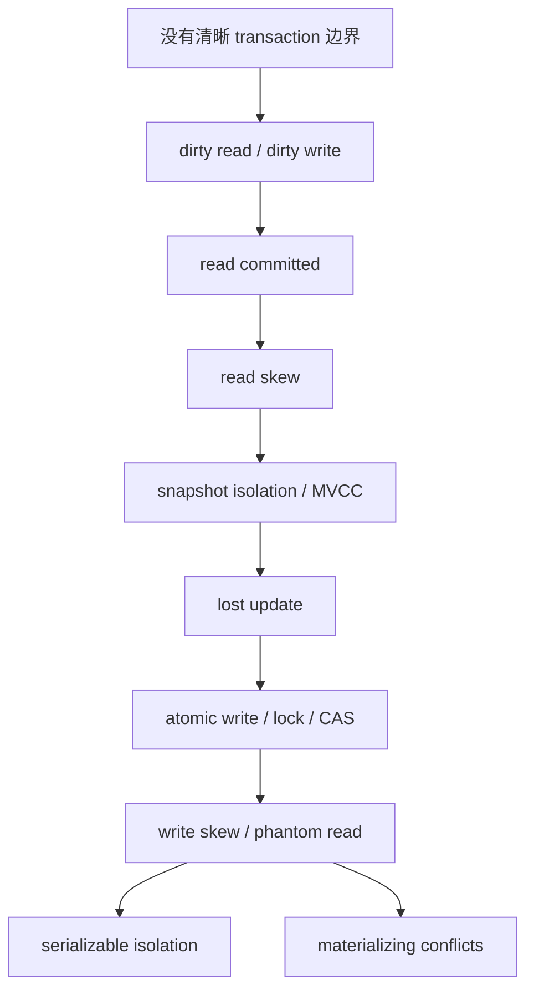

# Transaction

这一章可以用一句话概括：**transaction 是数据库给应用提供的一个编程模型，用来把 failure、partial update 和 concurrent read/write 包装成更容易推理的边界；但不同 isolation level 只解决不同范围的问题，不能只看“支持 ACID”这几个字。**

## 0. 总纲：这章到底在解决什么

transaction 要回答两类问题：

1. **失败时怎么办？** 一组操作做了一半，进程 crash、网络超时、constraint violation，已经写进去的部分要不要留下？这对应 `atomicity` 和 `durability`。
2. **并发时怎么看？** 两个 transaction 同时读写同一批数据，能不能看到对方的中间状态？会不会一起破坏业务 invariant？这对应 `isolation`。

本章最重要的递进关系是：



可以把这章读成一条“问题逐渐升级”的路线：

| 阶段 | 解决了什么 | 还解决不了什么 |
| --- | --- | --- |
| `read committed` | dirty read、dirty write | read skew、lost update、write skew、phantom read |
| `snapshot isolation` / `MVCC` | 一个 transaction 内看到一致快照，避免 read skew | lost update 取决于实现；通常不防 write skew |
| lost update protection | 同一 object 的 read-modify-write 不被覆盖 | 不同 object 共同破坏一个 invariant |
| explicit lock / constraint / materializing conflicts | 部分业务规则可以被手动转成可锁对象 | 复杂 predicate 仍难覆盖，容易漏锁或锁太粗 |
| `serializable` | 结果等价于某个串行执行顺序 | 成本更高，可能 abort/retry 更多 |

> [!CAUTION] Wenbo 注
> 这一章最值得建立的直觉不是“哪个 isolation level 更高级”，而是：**每个业务 invariant 依赖哪些 reads，之后又 writes 了哪些 objects；如果两个 transaction 并发执行，是否可能都基于同一个旧判断做出各自看似合法、合起来却非法的修改。**

## 1. Transaction 提供的基本抽象

`transaction` 把一组 read/write 操作合成一个 logical unit。理想情况下，应用可以把它当作：要么全部成功并 commit，要么失败并 abort/rollback；并发 transaction 之间也不应该看到不该看的中间状态。

`ACID` 是描述 transaction guarantee 的传统术语，但每个字母的含义需要拆开看：

| 属性 | 关注点 | 容易误解的地方 |
| --- | --- | --- |
| `Atomicity` | transaction 失败时可以撤销本 transaction 已做的 writes | 这里不是 concurrent programming 里的 atomic instruction；重点是 failure handling |
| `Consistency` | transaction 前后业务 invariant 应成立 | 很多 invariant 是应用定义的，数据库只能提供 constraint、isolation 等工具 |
| `Isolation` | 并发 transaction 互不干扰 | 实际数据库默认常常不是 `serializable`，弱隔离会留下 anomaly |
| `Durability` | commit 后的数据在 crash 后仍能恢复 | 依赖 WAL、fsync、replication、backup 等机制，没有绝对安全 |

最容易混的是 `atomicity` 和 `isolation`：

- `atomicity` 问的是：**如果中途失败，已经做了一半的修改怎么办？**
- `isolation` 问的是：**如果别人同时读写，会不会看到中间状态，或共同破坏业务规则？**

## 2. 为什么需要 multi-object transaction

很多数据库至少支持 single-object atomic write，例如更新一个 row、一个 document，或者做一个 atomic increment。只要 invariant 被封装在单个 object 内，这通常就够用。

但真实业务经常跨多个 object：

- 邮件系统中，`emails` 表的新邮件和用户的 `unread_count` 要同步；
- secondary index 要和 primary record 同步；
- denormalized data 的 canonical copy 和 derived copy 要同步；
- 一次业务操作可能同时修改账户余额、流水、订单状态和库存。

`multi-object transaction` 的价值就是把这些跨 object 的修改放进同一个 commit/abort 边界里。否则应用需要自己处理“第一步成功、第二步失败、第三步超时、不知道最终状态”的复杂恢复逻辑。

## 3. Abort：不是异常终点，而是 retry 入口

transaction abort 的意义是：数据库发现 conflict、deadlock、serialization failure、constraint violation 或其他错误时，可以丢弃当前 transaction 的 writes，让应用从干净状态继续。

但不是所有 abort 都应该重试：

| 错误类型 | 典型处理 |
| --- | --- |
| transient conflict / deadlock / serialization failure | retry whole transaction，通常配合 retry limit 和 backoff |
| constraint violation / bad input / business rejection | 返回错误，不应盲目 retry |
| transaction 之外已有 side effect | 需要 idempotency、outbox、去重 key，不能简单重放 |

特别要注意外部 side effect：发送 email、调用支付 API、发消息到 queue 这些操作不一定会随着数据库 transaction abort 而撤销。transaction 只管理数据库内部状态，跨系统原子性是另一个问题。

## 4. 第一层问题：dirty read

### 4.1 什么是 dirty read

`dirty read` 指一个 transaction 读到了另一个 transaction 尚未 commit 的 write。

例子：

```text
T1: insert into emails(user_id=1, subject='hello')
T1: update users set unread_count = unread_count + 1 where id = 1
T1: 尚未 commit

T2: read emails for user 1
T2: read users.unread_count for user 1
```

如果 T2 能看到 T1 的部分结果，就可能出现 mailbox 里有新邮件，但 unread counter 还是旧值；或者 T2 看到了一个后来被 T1 abort 的值。问题不只是“读到了脏数据”，而是应用会基于一个从未真正存在过的 database state 做决策。

### 4.2 如何解决 dirty read

`read committed` 要求：一个 transaction 的 writes 只有在 commit 后才对其他 transaction 可见。实现上常见两种方式：

- 对正在修改的数据加 lock，让其他 readers 等待；
- 保留旧的 committed version，让 readers 先读旧值，直到新 transaction commit。

第二种更常见，因为读不会被长时间阻塞，也是后面 `MVCC` 思想的基础。

### 4.3 dirty read 解决后还剩什么

即使不能读 uncommitted data，`read committed` 下每条 statement 仍然可能读到“执行这一刻最新的 committed value”。因此，同一个 transaction 里的两次 reads 可能来自不同时间点，这会导致 `read skew`。

## 5. 第二层问题：dirty write

### 5.1 什么是 dirty write

`dirty write` 指一个 transaction 覆盖了另一个 transaction 尚未 commit 的 write。

例子：两个用户同时竞拍同一件商品。业务要求最高 bid 和 bidder 要一起更新：

```text
T1: set price = 100
T1: set bidder = 'A'
T1: 尚未 commit

T2: set price = 120
T2: set bidder = 'B'
T2: commit
T1: commit
```

如果 T2 可以覆盖 T1 的 uncommitted write，最后可能出现 `price` 来自一个 transaction，`bidder` 来自另一个 transaction，产生混合状态。更糟的是，如果 T1 abort，T2 覆盖过的基础状态也会变得难以解释。

### 5.2 如何解决 dirty write

`read committed` 通常会用 row-level write lock 防止 dirty write：当 T1 修改某个 row 后，T2 要修改同一个 row 必须等 T1 commit 或 abort。

### 5.3 dirty write 解决后还剩什么

dirty write 只防止“覆盖未提交的 write”。它不防止两个 transaction 都先读取同一个已经 committed 的旧值，各自计算新值，再依次写回。这就是 `lost update`。

## 6. 第三层问题：read skew / non-repeatable read

### 6.1 什么是 read skew

`read skew` 指一个 transaction 的多次 reads 看到的不是同一个时间点的 database state。它读到的每个值都是 committed 的，所以它不是 dirty read；问题在于这些 committed values 彼此不属于同一个一致快照。

例子：Alice 给 Bob 转账 100。

```text
初始: Alice = 500, Bob = 500

T1: Alice -= 100
T1: Bob += 100
T1: commit

T2: read Alice -> 500   // T1 commit 前读
T2: read Bob   -> 600   // T1 commit 后读
T2: total = 1100
```

T2 读到的 Alice 和 Bob 都是 committed value，但组合起来不是任何真实时刻的总余额。这对 backup、analytics query、生成报表尤其危险，因为这些操作通常依赖“读取期间看到的是同一个一致世界”。

### 6.2 如何解决 read skew

`snapshot isolation` 解决这个问题：transaction 开始时确定一个 database snapshot，之后所有 reads 都基于这个 snapshot。

`MVCC` 是常见实现方式：同一 row 可以保留多个 committed versions，每个 transaction 根据自己的 snapshot 选择可见版本。

```text
transaction start
-> 记录当前可见的 committed transaction set
-> read 时选择对自己可见的 row version
-> 忽略开始后才 commit 的 versions
```

### 6.3 snapshot isolation 解决后还剩什么

snapshot isolation 让 reads 一致，但它不等于 serializable。它容易让人产生一种错觉：既然我看到的是一致快照，我做出的写入就一定安全。实际上，如果多个 transaction 基于同一个旧 snapshot 分别写入，仍然可能发生 `lost update` 或 `write skew`。

命名也很混乱：

- PostgreSQL 的 `repeatable read` 接近 snapshot isolation；
- Oracle 的 `serializable` 实际更接近 snapshot isolation，而不是真正 serializable；
- MySQL/InnoDB 的 `repeatable read` 又有自己的行为细节。

所以不要只看 isolation level 名字，要看它到底防哪些 anomaly。

## 7. 第四层问题：lost update

### 7.1 什么是 lost update

`lost update` 发生在同一个 object 的 read-modify-write cycle 中：

```text
read old value
-> application computes new value
-> write new value back
```

例子：两个 client 同时给 counter 加 1。

```text
初始: counter = 42

T1: read counter -> 42
T2: read counter -> 42
T1: write counter = 43
T2: write counter = 43

最终: counter = 43，而不是 44
```

这里没有 dirty read，也没有 dirty write。两个 transaction 读到的都是 committed value，写入时覆盖的也不是 uncommitted value。问题是 T2 的写入丢掉了 T1 的更新效果。

典型场景：

- counter increment；
- account balance update；
- 修改 JSON document 中的 list；
- 两个用户同时编辑 wiki 页面，然后整页写回。

### 7.2 如何解决 lost update

| 方法 | 思路 | 适合场景 |
| --- | --- | --- |
| atomic write | 让数据库直接执行 `value = value + 1` | counter、balance 这类简单表达式 |
| explicit locking | 先 `SELECT ... FOR UPDATE` 锁住要修改的 row | 修改前需要应用逻辑检查 |
| automatic detection | 数据库发现 read/write conflict 后 abort 一个 transaction | 依赖数据库和 isolation level |
| conditional write / CAS | `WHERE version = old_version`，不匹配则失败 | Web 表单、wiki 编辑、optimistic locking |

wiki 编辑里的 version check 很典型：

```sql
UPDATE wiki_pages
SET content = 'new content', version = version + 1
WHERE id = 1234
  AND version = 7;
```

如果返回 0 rows affected，说明有人已经基于 version 7 之后的版本提交了修改。应用需要 retry、merge，或让用户确认覆盖。

### 7.3 ORM 特别容易隐藏 lost update

很多 ORM 代码看起来像普通对象修改：

```csharp
var counter = db.Counters.Single(c => c.Id == id);
counter.Value++;
await db.SaveChangesAsync();
```

如果生成的是“把应用算出的新值写回去”，它不是数据库侧 atomic increment。`SaveChanges()` 自带 transaction 只能保证这一批 writes all-or-nothing，不能自动保证不会 lost update。需要显式使用 database-side update、concurrency token、version column，或更高 isolation level。

### 7.4 lost update 解决后还剩什么

lost update 关注的是“同一个 object 被覆盖”。但有些 invariant 不是单行单对象的，而是跨多行、多对象的。两个 transaction 可以各自写不同 row，不发生同 row 覆盖，却共同破坏一个跨 row invariant。这就是 `write skew`。

## 8. 第五层问题：write skew

### 8.1 什么是 write skew

`write skew` 指两个 transaction 读取同一组数据，各自基于这个全局判断修改不同 object，单看每个写入都合法，合起来却破坏 invariant。

医生值班例子：

```text
invariant: 至少 1 个医生 on_call
初始: Aaliyah = on_call, Bryce = on_call

T1(Aaliyah): read on_call doctors -> 2
T2(Bryce):   read on_call doctors -> 2
T1: set Aaliyah = off_call
T2: set Bryce = off_call

最终: 0 个医生 on_call
```

这不是 dirty write，因为两人没有写同一个 row；也不是普通 lost update，因为没有一个 write 覆盖另一个 write。问题在于两个 transaction 的决策都依赖“至少还有另一个医生值班”这个 predicate，但它们并发执行时都看到了同一个旧事实。

### 8.2 write skew 和 lost update 的关系

| 异常 | 读什么 | 写什么 | 破坏方式 |
| --- | --- | --- | --- |
| `lost update` | 同一个 object 的旧值 | 同一个 object | 后写覆盖先写，丢掉一次更新 |
| `write skew` | 一组 objects / 一个 predicate 的整体状态 | 不同 objects | 每个局部写都合法，组合后 invariant 被破坏 |

可以把 `write skew` 看作 lost update 的广义版本：冲突不再集中在同一 row，而是藏在“这些 rows 共同满足某个业务规则”里。

### 8.3 如何解决 write skew

可选方案取决于 invariant 能不能被数据库直接表达：

- 如果能用 `unique constraint`、`foreign key`、`check constraint`、exclusion constraint 或 trigger 表达，让数据库 enforce；
- 如果所有相关 rows 已经存在，可以在检查前用 `SELECT ... FOR UPDATE` 锁住这些 rows；
- 如果冲突来自一个查询 predicate，而没有具体 row 可锁，需要 predicate lock、index-range lock、`serializable isolation`，或把冲突 materialize 成可锁 row。

### 8.4 write skew 解决后还剩什么

如果 predicate 查询返回的是“当前不存在任何冲突 row”，普通 row lock 就没有对象可锁。并发 transaction 都可能看到“没有冲突”，然后各自 insert 出冲突数据。这就是 `phantom read` 问题最常见的形态。

## 9. 第六层问题：phantom read

### 9.1 什么是 phantom read

`phantom read` 指一个 transaction 的 write 改变了另一个 transaction 中某个 search query 的结果集。它不一定是“同一条查询读两次结果不一样”这么简单，更关键的是：并发 insert/delete 让原本基于 predicate 的判断失效。

会议室预订例子：

```text
invariant: 同一 room 同一时间段不能有重叠 booking

T1: query bookings where room=101 and time overlaps 10:00-11:00 -> empty
T2: query bookings where room=101 and time overlaps 10:00-11:00 -> empty
T1: insert booking(room=101, 10:00-11:00)
T2: insert booking(room=101, 10:00-11:00)

最终: 两个重叠 booking
```

第一次 query 返回 empty，所以没有 row 可以 `SELECT FOR UPDATE`。冲突存在于“room=101 and time overlaps 10:00-11:00”这个 predicate 上，而不是某个已有 row 上。

更多例子：

- 用户注册：检查 username 不存在，然后 insert；
- 防止透支：检查账目总和仍为正，然后 insert 新支出；
- 多人游戏：检查某个位置没有棋子，然后移动过去；
- 工单分配：检查某个班次容量未满，然后插入排班。

### 9.2 如何解决 phantom read

| 方法 | 思路 | 代价 / 限制 |
| --- | --- | --- |
| unique / exclusion constraint | 把冲突表达成数据库 constraint | 只适合数据库能直接表达的规则 |
| predicate lock | 锁住满足某个 search condition 的范围 | 实现复杂，可能影响性能 |
| index-range lock / next-key lock | 锁住索引范围，防止范围内插入 phantom | 依赖查询能走合适索引 |
| serializable isolation | 让数据库检测或阻止不可串行化执行 | 可能 abort，需要 retry |
| materializing conflicts | 人工创建可锁 rows，把 predicate conflict 变成 row conflict | 建模复杂，粒度难选 |

## 10. Materializing Conflicts：把抽象冲突变成可锁 row

`materializing conflicts` 的思路是：如果真实业务冲突没有现成 row 可锁，就人为创建代表冲突空间的 rows。

会议室预订可以先创建 `room_time_slots`：每个 room + time slot 对应一行。预订前先锁住对应 slot rows：

```sql
SELECT *
FROM room_time_slots
WHERE room_id = 101
  AND slot_start >= '2026-05-08 10:00'
  AND slot_start <  '2026-05-08 11:00'
FOR UPDATE;
```

然后再检查 booking 并插入。这样并发预订同一时间段会争抢同一批 lock rows，冲突从 predicate 层面变成 row 层面。

它的本质是：

```text
原本冲突发生在“没有 row 的 predicate 空间”
-> 人为创建代表 predicate 空间的 rows
-> 用 row lock 表达业务冲突
```

但它通常是 last resort：

- 需要额外表和额外流程；
- 锁粒度太粗会降低并发，太细又可能漏锁；
- 很多 predicate 很难完整 materialize；
- 业务规则变化时，materialized lock model 也要跟着变。

更自然的优先级通常是：数据库 constraint > atomic update / CAS > explicit lock > serializable isolation > materializing conflicts。

## 11. Serializable：最终目标是等价于某个串行顺序

更完整的整理见：[Serializable](Serializable.md)。

`serializable isolation` 的定义不是“没有并发”，而是：并发执行的结果必须等价于某个 serial order。

如果两个医生请假 transaction 是 serializable 的，结果必须等价于下面两种顺序之一：

```text
顺序 1: Aaliyah 先下班，Bryce 后检查 -> Bryce 不能下班
顺序 2: Bryce 先下班，Aaliyah 后检查 -> Aaliyah 不能下班
```

不会出现“两人都以为还有 2 个医生，所以都下班”的结果。serializable 的价值在于它从根上阻止这些无法解释为串行顺序的 interleaving。

代价是性能和 abort/retry：数据库可能使用 strict serial execution、two-phase locking、serializable snapshot isolation 等方式实现。实现不同，吞吐、延迟和冲突行为也不同。

## 12. Distributed Transaction：跨节点的 atomic commit

更完整的整理见：[Distributed-Transaction](Distributed-Transaction.md)。

分布式事务关注的是另一个维度：当一个 transaction 涉及多个 shard、多个 database node，甚至 database 和 message broker 这类异构系统时，如何保证所有 participant 对 commit/abort 得出同一个结论。这里的核心问题叫 `atomic commit`，典型协议是 `two-phase commit`（2PC）。

注意 `2PC` 和 `2PL` 不是一回事：`2PL` 解决 serializable isolation，`2PC` 解决跨 participant 的 all-or-nothing commit。

## 13. 易混点速查

| 概念 | 不是 | 是 |
| --- | --- | --- |
| `atomicity` | 并发里的 atomic increment | transaction 失败时 all-or-nothing abort |
| `consistency` | 数据库自动知道所有业务规则 | 应用定义 invariant，数据库提供工具帮助维护 |
| `read committed` | 每个 transaction 都看到一致快照 | 不读未提交、不覆盖未提交 |
| `snapshot isolation` | 读最新 committed value | 读 transaction 开始时的一致快照 |
| `repeatable read` | 所有数据库含义一致 | 名字混乱，要看具体实现 |
| `lost update` | 所有并发写问题 | 同一 object 的 read-modify-write 被覆盖 |
| `write skew` | dirty write 的别名 | 不同 objects 的 writes 共同破坏跨 row invariant |
| `phantom read` | 普通重复读变了 | search predicate 的结果集被并发 write 改变 |
| `SELECT FOR UPDATE` | 万能防并发 | 只能锁实际返回的 rows，空结果集通常没 row 可锁 |
| `materializing conflicts` | 普通建模优化 | 为了锁 predicate，人为创建代表冲突的 rows |

## 14. 判断框架：看到一个并发业务规则时怎么想

按这个顺序问：

1. 这个 invariant 是单 object 内的，还是跨多个 objects？
2. 更新能不能表达成数据库侧 atomic operation？
3. 冲突是否集中在同一 row，可以用 optimistic locking、version check 或 `SELECT FOR UPDATE`？
4. 规则能不能用数据库 constraint 直接表达？
5. 是否依赖“查询结果为空”或“满足 predicate 的集合”？如果是，要小心 phantom read。
6. 当前 isolation level 是否真的防这个 anomaly？不要只看名字。
7. 如果手动 lock 容易漏，是否应该使用 serializable isolation？
8. 如果 serializable 不适合，是否可以把 predicate conflict materialize 成可锁 rows？

最后可以把本章记成一句话：**transaction 不是魔法安全罩，而是一组逐层增强的保证；你要把业务 invariant 映射到具体 read/write pattern，再判断当前 isolation level 是否覆盖这种并发异常。**
